# Travel Agency App 🌍

Welcome to the Travel Agency App repository! This Angular project, integrated with Firebase, allows users to explore, book, and review exciting travel trips. With authentication, role-based access control, and admin panels, managing trips and user interactions is made easy.

## Features ✨

- User Authentication: Sign up, log in, and log out securely to access personalized features.
- Role-Based Access Control: Separate admin, manager and user roles for different privileges and functionality.
- Admin Panel: Manage trips and users through an intuitive admin interfaces.
- Trip Booking: Browse through a collection of enticing trips and make bookings with ease.
- Trip Reviews: Share your experiences by leaving reviews for trips you've participated in.

## Technologies Used 🛠️

- Angular - A powerful JavaScript framework for building robust web applications.
- Firebase - A comprehensive platform for developing mobile and web applications, providing authentication, database, and hosting services.

### Home Panel
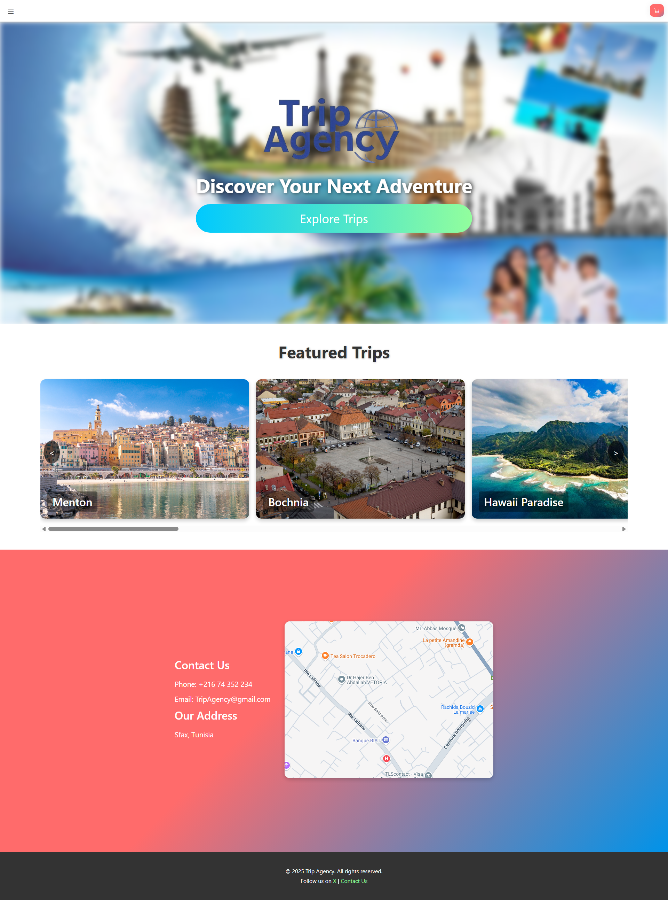

### Anonymous Menu

### Trips Catalogue
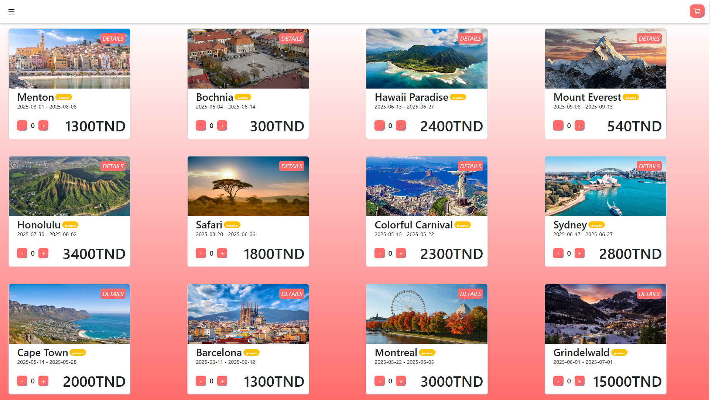

### Login panel
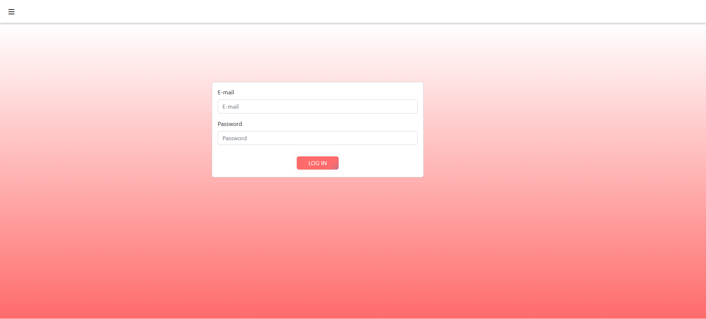

### Signup panel
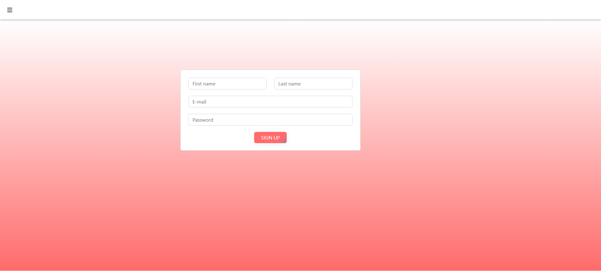

### Trip Details
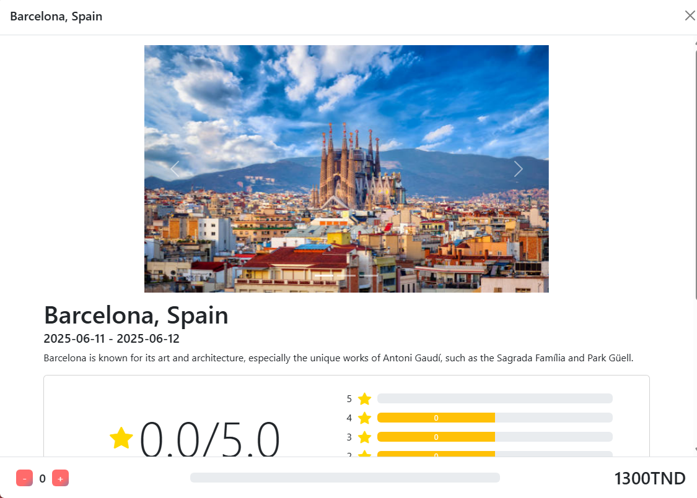
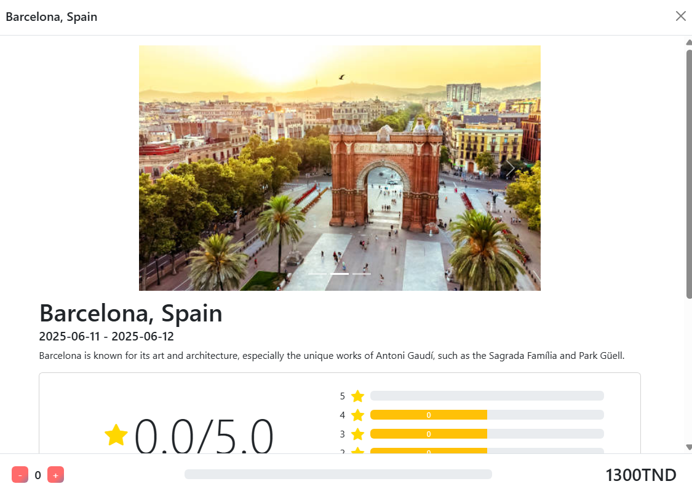

### Reviews
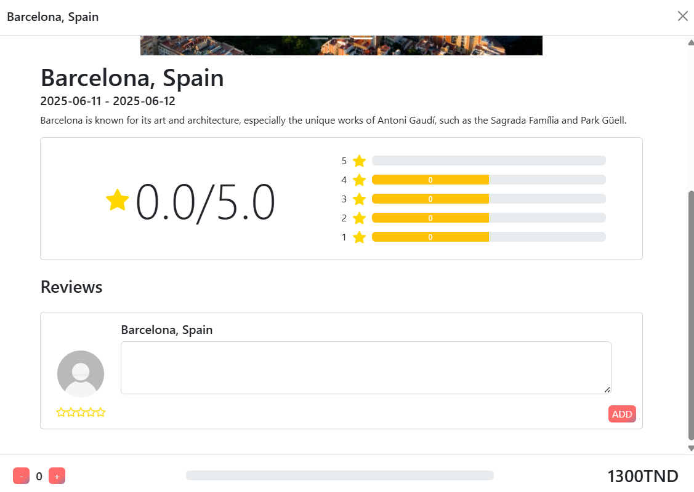
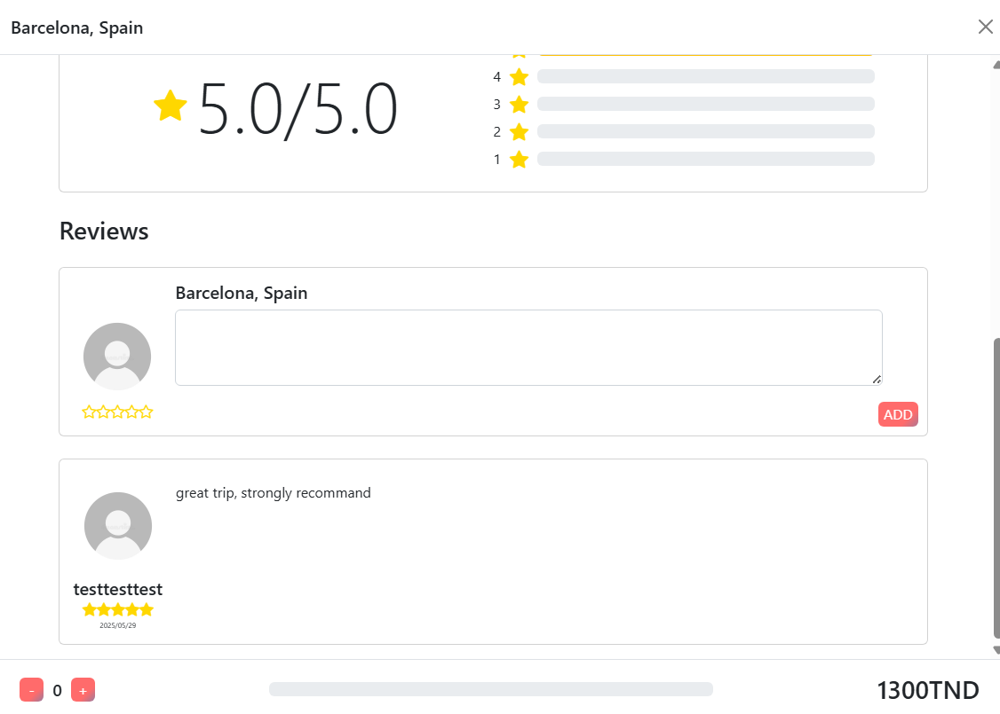

### Admin Menu

### Dashboard Panel
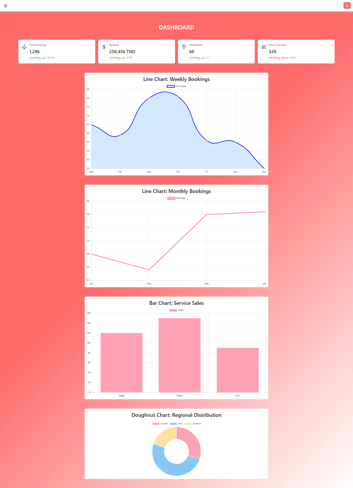

### Manage Trips Panel
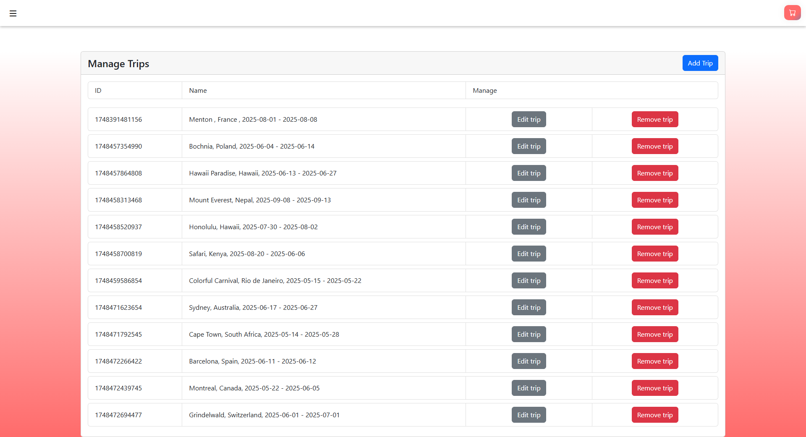
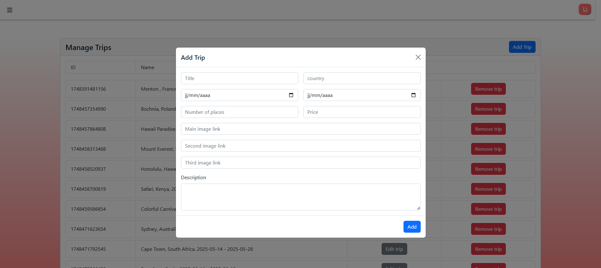
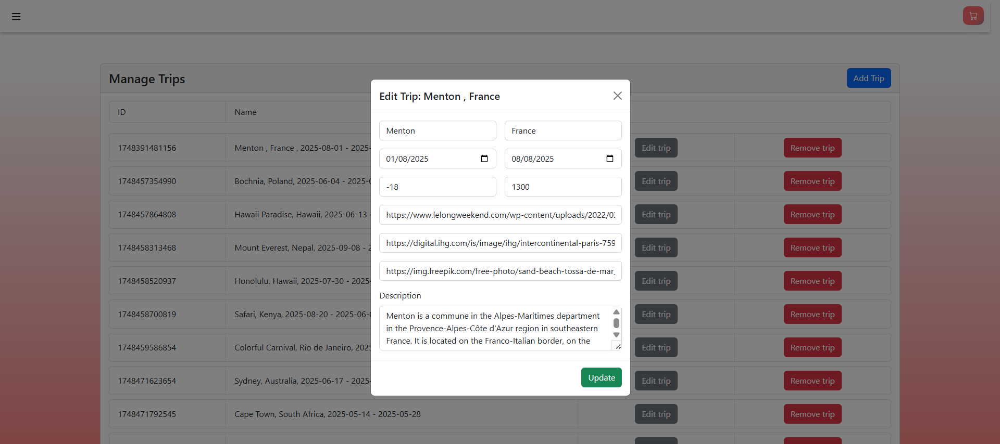

### Manage Users Panel
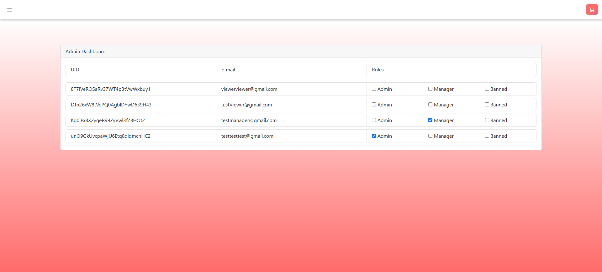

